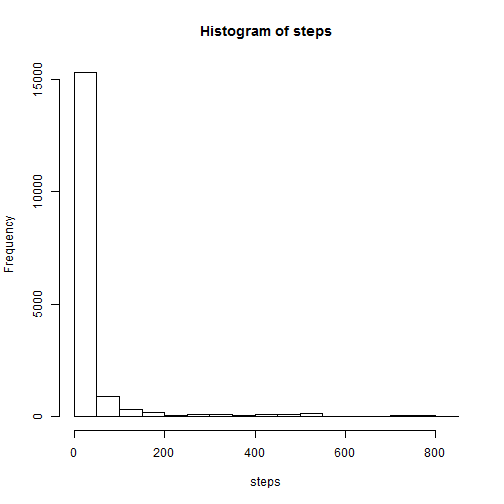

=============================================
Reproducible Research Assignment 

============================================
        Loading and Processing Data
===========================================

```r
setwd("C:/Users/jwambua/Documents/My Stats/R language/Reproducible research")
data <- read.csv("activity.csv", header = T, sep = ",")
attach(data)
str(data)
```

```
## 'data.frame':	17568 obs. of  3 variables:
##  $ steps   : int  NA NA NA NA NA NA NA NA NA NA ...
##  $ date    : Factor w/ 61 levels "10/1/2012","10/10/2012",..: 1 1 1 1 1 1 1 1 1 1 ...
##  $ interval: int  0 5 10 15 20 25 30 35 40 45 ...
```

```r
hist(steps, main = "Histogram of Steps")
```

 

```r
mean(steps, na.rm = T)
```

```
## [1] 37.38
```

```r
median(steps, na.rm = T)
```

```
## [1] 0
```


##Average daily activity pattern


```r
StepsMean <- tapply(steps, interval, mean, na.rm = T)
StepsInterval = unique(interval)
Steps = data.frame(StepsInterval, StepsMean)
plot(StepsInterval, StepsMean, type = "l", ylab = "Average steps", xlab = "Interval")
```

 

```r
StepsMax = subset(Steps, Steps$StepsMean == max(Steps$StepsMean))
StepsMax
```

```
##     StepsInterval StepsMean
## 835           835     206.2
```

##Imputing missing values


```r
Missing_data <- data[!complete.cases(data), ]
nrow(Missing_data)
```

```
## [1] 2304
```

```r


## data Imputation

data[is.na(data)] <- mean(steps, na.rm = T)
attach(data)
```

```
## The following objects are masked from data (position 3):
## 
##     date, interval, steps
```

```r
hist(steps)
```

 

```r
tapply(steps, date, mean)
```

```
##  10/1/2012 10/10/2012 10/11/2012 10/12/2012 10/13/2012 10/14/2012 
##    37.3826    34.3750    35.7778    60.3542    43.1458    52.4236 
## 10/15/2012 10/16/2012 10/17/2012 10/18/2012 10/19/2012  10/2/2012 
##    35.2049    52.3750    46.7083    34.9167    41.0729     0.4375 
## 10/20/2012 10/21/2012 10/22/2012 10/23/2012 10/24/2012 10/25/2012 
##    36.0938    30.6285    46.7361    30.9653    29.0104     8.6528 
## 10/26/2012 10/27/2012 10/28/2012 10/29/2012  10/3/2012 10/30/2012 
##    23.5347    35.1354    39.7847    17.4236    39.4167    34.0938 
## 10/31/2012  10/4/2012  10/5/2012  10/6/2012  10/7/2012  10/8/2012 
##    53.5208    42.0694    46.1597    53.5417    38.2465    37.3826 
##  10/9/2012  11/1/2012 11/10/2012 11/11/2012 11/12/2012 11/13/2012 
##    44.4826    37.3826    37.3826    43.7778    37.3785    25.4722 
## 11/14/2012 11/15/2012 11/16/2012 11/17/2012 11/18/2012 11/19/2012 
##    37.3826     0.1424    18.8924    49.7882    52.4653    30.6979 
##  11/2/2012 11/20/2012 11/21/2012 11/22/2012 11/23/2012 11/24/2012 
##    36.8056    15.5278    44.3993    70.9271    73.5903    50.2708 
## 11/25/2012 11/26/2012 11/27/2012 11/28/2012 11/29/2012  11/3/2012 
##    41.0903    38.7569    47.3819    35.3576    24.4688    36.7049 
## 11/30/2012  11/4/2012  11/5/2012  11/6/2012  11/7/2012  11/8/2012 
##    37.3826    37.3826    36.2465    28.9375    44.7326    11.1771 
##  11/9/2012 
##    37.3826
```

```r
tapply(steps, date, median)
```

```
##  10/1/2012 10/10/2012 10/11/2012 10/12/2012 10/13/2012 10/14/2012 
##      37.38       0.00       0.00       0.00       0.00       0.00 
## 10/15/2012 10/16/2012 10/17/2012 10/18/2012 10/19/2012  10/2/2012 
##       0.00       0.00       0.00       0.00       0.00       0.00 
## 10/20/2012 10/21/2012 10/22/2012 10/23/2012 10/24/2012 10/25/2012 
##       0.00       0.00       0.00       0.00       0.00       0.00 
## 10/26/2012 10/27/2012 10/28/2012 10/29/2012  10/3/2012 10/30/2012 
##       0.00       0.00       0.00       0.00       0.00       0.00 
## 10/31/2012  10/4/2012  10/5/2012  10/6/2012  10/7/2012  10/8/2012 
##       0.00       0.00       0.00       0.00       0.00      37.38 
##  10/9/2012  11/1/2012 11/10/2012 11/11/2012 11/12/2012 11/13/2012 
##       0.00      37.38      37.38       0.00       0.00       0.00 
## 11/14/2012 11/15/2012 11/16/2012 11/17/2012 11/18/2012 11/19/2012 
##      37.38       0.00       0.00       0.00       0.00       0.00 
##  11/2/2012 11/20/2012 11/21/2012 11/22/2012 11/23/2012 11/24/2012 
##       0.00       0.00       0.00       0.00       0.00       0.00 
## 11/25/2012 11/26/2012 11/27/2012 11/28/2012 11/29/2012  11/3/2012 
##       0.00       0.00       0.00       0.00       0.00       0.00 
## 11/30/2012  11/4/2012  11/5/2012  11/6/2012  11/7/2012  11/8/2012 
##      37.38      37.38       0.00       0.00       0.00       0.00 
##  11/9/2012 
##      37.38
```


